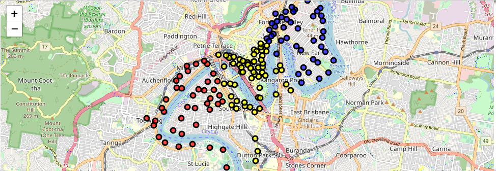

# Brisbane City Bike Kmeans Clustering Project :

L'objectif principal de ce projet est de proposer un k-means clustering de Bristol City Bike en fonction de l'emplacement des stations vélos en utilisant spark. Le fichier BRISBANE-city-bike.json  contient des informations concernant l’emplacement de chaque vélo.

## Le projet est structuré comme suit :

:arrow_forward: config : contient le fichier **_"properties.conf"_** qui regroupent des configurations indispensables pour la réalisation du projet : les chemins de l'input et de l'output, ainsi que la définition du nombre de clusters.

:arrow_forward: data : contient les données utilisées **_"Bristol-city-bike.json"_** pour la réalisation du projet.

:arrow_forward: exported : contient le fichier de données sauvegardé à la fin du projet. Dans ce jeu de données on trouve : Latitude, Longitude, Prediction.

:arrow_forward: Kmeans.ipynb : Jupyter Notebook qui contient les lignes de codes avec les sorties.

:arrow_forward: La Map trouvée à l'issu du projet, qui représente la répartition des différents clusters dans la ville Brisbane.

